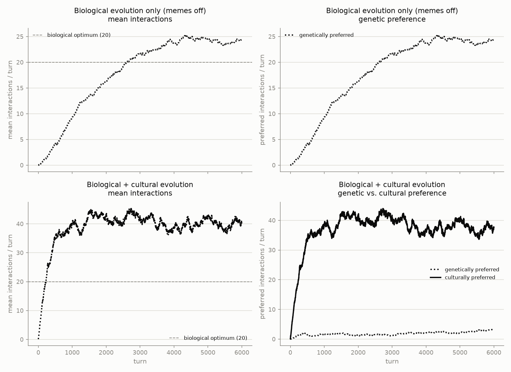

# GlobalBrain



## Theory

This is a fresh project. The goal is to check a hypothesis about the interplay of
cultural and genetic evolution. We assume a population of individuals that can
interact with each other, leaving it open what precisely this means. The number
of interactions an individual makes is a primitive. The propensity to interact
is determined by your genes and your memes. Everyone carries, say, 100 1-bit
memes and 100 1-bit genes. If all are 0 you do roughly 0 interactions per turn,
if all are 1 you do 200.

There is a genetic replicator dynamic going on. Stipulate a fitness function
such that 30 interactions are biologically optimal.

But there is also a memetic replicator dynamic going on: your memes can
randomly catch 1 meme from someone else at each interaction. This is how memes
that push for interaction replicate more. Let this be 10 times faster than the
genetic replicator dynamic, having 1 genetic update per 10 memetic ones.

Let this run for a while. Start with a random distribution of genes and only a
few memes being turned to cooperation.

Make one PNG with four plots. Top row: just biological evolution. Bottom row:
with memetic evolution turned on. Left column: the mean number of interactions
per turn. Right column: the genetically and memetically preferred number of
interactions per turn.

## Implementation

The theory above leaves several things unspecified; this is how they were
resolved:

- **Population.** 300 individuals, each carrying 100 gene bits and 100 meme
  bits. An individual's interactions per turn is
  `100 * (fraction of gene bits set + fraction of meme bits set)`, so genes
  and memes contribute equally to the 0-200 range described in the theory.

- **Genetic replicator dynamic.** Implemented as an asexual Wright-Fisher
  process: each generation, fitness is a Gaussian centered on 20 interactions
  (`exp(-(interactions - 20)^2 / (2 * width^2))`, `width = 25`), parents are
  resampled with replacement in proportion to fitness (one parent per
  offspring — no recombination), and offspring inherit that parent's genes
  wholesale with a per-locus mutation rate of 0.05%. Offspring also inherit
  the parent's current memes unchanged, as a stand-in for cultural upbringing,
  distinct from the horizontal transmission below.

- **Memetic replicator dynamic.** Implemented as two mechanisms per turn:
  1. Mutation: each meme bit independently flips with a tiny probability
     (0.1%). Since memes start at all-zero, this is the only source of novel
     memes — everything below is about whether a flip then spreads or dies
     out.
  2. Contact-based horizontal transmission: each individual is given as many
     "interaction slots" as its current (rounded) interaction count, all
     slots in the population are shuffled and paired up to form that turn's
     meetings, and in each meeting both participants catch one meme from
     their partner — two independent random loci are drawn (one per
     direction), not a single shared locus, so this is not a symmetric swap
     of one position, but two separate draws of which meme gets copied each
     way. Because the number of slots an individual gets scales with its own
     interaction count, individuals whose gene/meme combination pushes them
     toward more interactions take part in more meetings per turn, and so get
     more chances to spread their memes into other carriers — this is the
     mechanism by which memes that push for interaction replicate more.

- **Timescale.** One genetic generation = 10 memetic turns. The "just
  biological evolution" condition simply skips the memetic step each turn, so
  memes never mutate or spread and stay at all-zero forever, which also means
  interactions there are driven by genes alone, in [0, 100] instead of
  [0, 200], and there's nothing meaningful to plot for a "memetically
  preferred" line, so it's omitted from that row.

- **Initial conditions.** Both genes and memes start at all-zero for every
  individual, in both conditions — there is no seeded or random starting
  variation at all. Any 1-bits that appear later come entirely from mutation
  (genetic or memetic), with selection and, for memes, contact-based spread
  then acting on that variation.

- **Run length and output.** Each condition runs for 600 genetic generations
  (6000 recorded turns) — long enough for the biological-only condition to
  visibly plateau, since its low mutation rate makes it slow to respond. The
  left column plots mean interactions per turn across the population. The
  right column plots the "genetically preferred" and "culturally preferred"
  number of interactions, i.e. the gene-driven and meme-driven components of
  the interaction formula above (`100 * mean gene fraction` and
  `100 * mean meme fraction`), averaged over the population; both are drawn
  in black, distinguished by linestyle (solid vs. dashed) rather than color.
  The plot labels say "cultural" rather than "memetic" for readability; the
  code (`memetic_step`, `meme_component`, etc.) keeps the original
  terminology internally. Two copies are written: `evolution.png` on the
  default chart surface, and `evolution_bg.png` on a background sampled
  directly from a reference color file (`color.png.png`) supplied for this
  project (`#fef2f2`). The left column's single "mean interactions" line and
  overall chart styling (gridlines, spines, the categorical blue) follow this
  repo's dataviz conventions, validated for colorblind-safe separation.

  In practice, the biological-only condition rises from 0 and settles close
  to the optimum of 20 (typically the low-to-mid 20s) — this is still a
  mutation-selection balance, not exact convergence (symmetric mutation
  always pulls a little toward the neutral midpoint of 50), but a low enough
  gene mutation rate keeps that pull small. With memetic evolution turned on,
  the meme component grows much faster than the gene component (mutation
  supplies meme variation 2x faster per-locus than gene variation, and it
  then spreads through contact on top of that) and ends up dominant, so the
  population settles at a mean interaction rate roughly double what
  biological evolution alone produces — meme spread outpaces genetic
  counter-selection because it runs 10x faster and starts from a higher
  effective mutation rate.

  The gene mutation rate is the main lever for how tightly the
  biological-only condition tracks the literal optimum: raising the fitness
  `width` (flatter selection) or the mutation rate pulls it further away
  (toward the neutral 50), while lowering either tightens it — but lowering
  `width` also weakens genetic counter-selection in the memetic condition (it
  becomes better at resisting meme-driven deviation too), which shrinks the
  gap between the two conditions. Lowering the mutation rate instead tightens
  biological-only convergence without materially blunting that contrast.

  All parameters above (population size, fitness width, mutation rates,
  generation count) are reasonable choices rather than values derived from
  the theory, and can be changed in `src/globalbrain/model.py` and
  `src/globalbrain/experiment.py`.

## Usage

This project uses [uv](https://docs.astral.sh/uv/).

```sh
uv sync
uv run globalbrain
```

This writes `evolution.png` and `evolution_bg.png` to the repository root.
